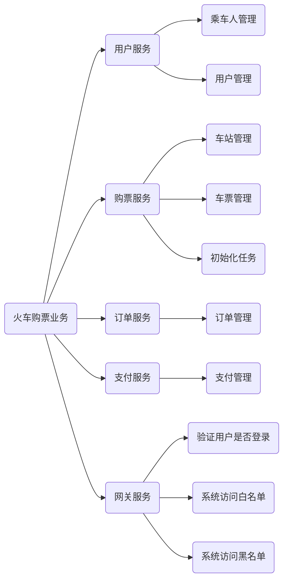

# TicketPurchase
## 业务功能

```mermaid
flowchart LR
    A1(火车购票业务)
    B1(用户服务)
    B2(购票服务)
    B3(订单服务)
    B4(支付服务)
    B5(网关服务)
    A1-->B1
    A1-->B2
    A1-->B3
    A1-->B4
    A1-->B5

    B11(乘车人管理)
    B12(用户管理)
    B1-->B11
    B1-->B12

    B21(车站管理)
    B22(车票管理)
    B23(初始化任务)
    B2-->B21
    B2-->B22
    B2-->B23

    B31(订单管理)
    B3-->B31

    B41(支付管理)
    B4-->B41

    B51(验证用户是否登录)
    B52(系统访问白名单)
    B53(系统访问黑名单)
    B5-->B51
    B5-->B52
    B5-->B53
```

**使用springboot 多模块构建**